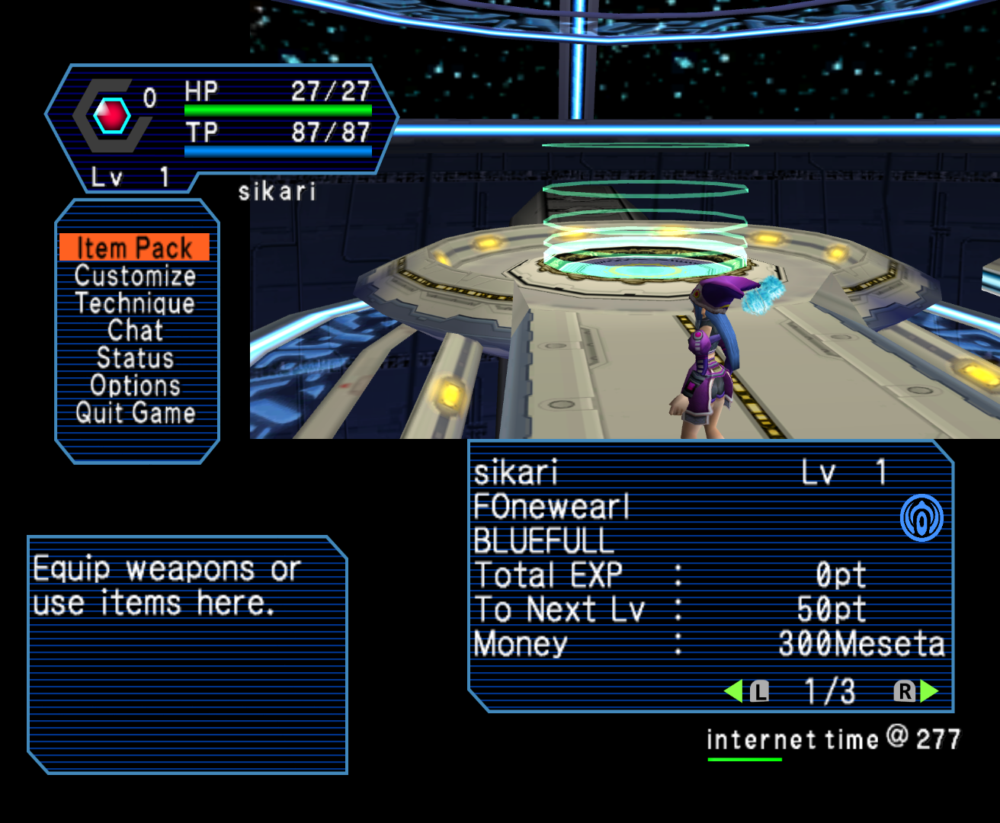

# PSO High Resolution "Dreamcube" UI
Fan-made High resolution UI for Phantasy Star Online Ep. I&II (and Plus).

Available for downlad as a _Resource Pack_ compatible with Dolphin emulator.

__Does not work on real hardware__

## Important
I would ask that you do not create mirrors, re-packs, edits, and that you do not include any file from this project in another project. Thank you.

Links to the main page are preferred to links that point to the releases section.

## Showcase
<details>
  <summary>Image(s)</summary>
  
  
  
  
</details>

## How to download

Click on the link : [Latest Release](https://github.com/eleriaqueen/pso-highres-dreamcube-ui/releases/latest) and download the available release zip file.

## How to remove the teal lines on menu screen

Ralf(at)gc-forever made codes for PSO EpI&II USA 1.00 / 1.01 and 1.02 (Plus) which tackle this issue.

<details>
  <summary>PSO Ep.I&II USA 1.00</summary>
  
  ```
  Disable light-blue/teal lines on menu screen [Ralf] (may also work for v1.01)
  0424C090 60000000
  0424C0C8 60000000
  ```
  
</details>

<details>
  <summary>PSO Ep.I&II USA 1.02 (Plus)</summary>
  
  ```
  Disable light-blue/teal lines on menu screen [Ralf]
  0424D20C 60000000
  0424D244 60000000
  ```
  
</details>

## Legal
Phantasy Star Online is a registered trademark of SEGA in the United States and other countries.
This project is not endorsed, sponsored, nor authorized by SEGA.
