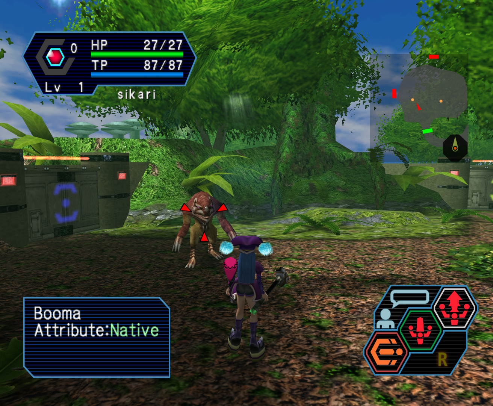

# PSO High Resolution "Dreamcube" UI
Fan-made High resolution UI for Phantasy Star Online Ep. I&II (& Plus).

Available for downlad as a _Resource Pack_ compatible with Dolphin emulator.

__Does not work on real hardware__

## Important
I would ask that you do not create mirrors, re-packs, edits, and that you do not include any file from this project in another project. Thank you.

Links to the main page are preferred to links that point to the releases section.

## Showcase

  
Image(s)

  
  
  

## How to get rid of the teal lines on menu screen

There's an AR code for that !
You'll find one for your game version on there -> https://github.com/eleriaqueen/psogc-codes-backup
There are a code to get rid of the black background on menu screen...

## Legal
Phantasy Star Online is a registered trademark of SEGA in the United States and other countries.
This project is not endorsed, sponsored, nor authorized by SEGA.
